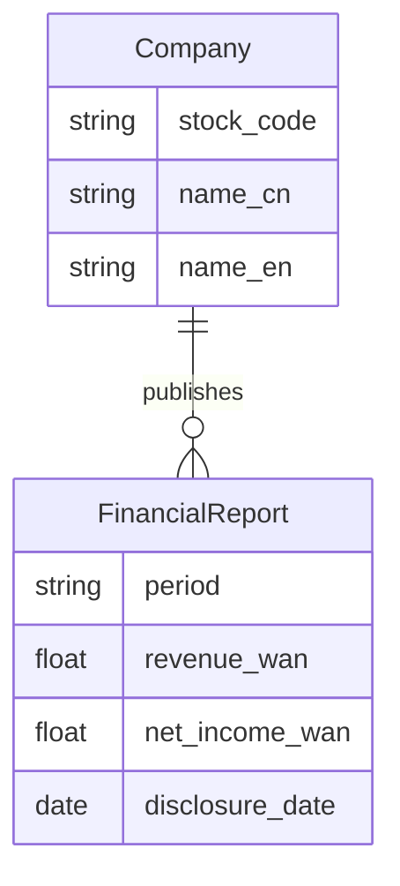
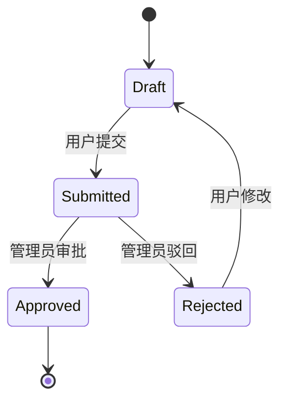

# 领域模型: [项目名称]

<!-- 
本文件是 AI agent 的"逻辑底座"。agent 在生成代码前会读取此文件,
确保实体命名、业务规则、数据处理逻辑和领域模型一致。

填写方式:
- 运行 /init 自动从探索文件生成（推荐）
- 或手动填写以下各段

维护规则:
- 每次 Phase 5 EVOLVE 评审时检查是否需要更新
- 新增实体/规则时同步更新此文件
- 此文件的业务规则段落由你拥有,agent 只能建议修改,不能自行修改
-->

## 核心实体

<!-- 
用 mermaid erDiagram 画出核心实体和关系。
每个实体标注 2-3 个关键属性,不需要列出所有字段。

示例:

-->

```mermaid
erDiagram
    %% 在此绘制实体关系图
```

## 业务规则（不可违反）

<!-- 
列出 agent 在生成代码时绝对不能违反的规则。
用"必须/不得/当…时"句式,确保无歧义。

示例:
- 所有金额单位统一为人民币万元;千元数据源需 ×0.1 转换,不是 ×10000
- 财报数据以 cninfo 官方披露为权威源,AkShare 数据需交叉验证
- 当季度数据为 YTD 累计时,必须差减上季度得到单季值
- 用户上传的简历不得存储超过 30 天
-->

1. [规则 1]
2. [规则 2]
3. [规则 3]

## 术语表

<!-- 
确保代码中的变量名、API 字段名和领域术语一致。
agent 生成代码时以此表为准。
-->

| 中文术语 | 英文术语 | 定义 | 代码命名 |
|--------|--------|------|---------|
| [术语] | [term] | [定义] | `variable_name` |

## 数据边界

### 数据源

<!-- 
列出所有外部数据源,标注可信度和使用注意事项。

示例:
| 数据源 | 类型 | 可信度 | 注意事项 |
|--------|------|--------|---------|
| cninfo PDF | 官方财报 | 权威 | 需手动/脚本下载 |
| AkShare API | 第三方聚合 | 中 | 参数名有版本漂移 |
| BigQuery | 内部存储 | 高 | asia-east1 节点 |
-->

| 数据源 | 类型 | 可信度 | 注意事项 |
|--------|------|--------|---------|
| [数据源] | [类型] | [高/中/低] | [注意事项] |

### 更新频率

<!-- 各数据源的更新周期,供巡检 loop 使用 -->

| 数据源 | 更新周期 | 检查方式 |
|--------|---------|---------|
| [数据源] | [日/周/季] | [API 调用 / 手动检查] |

### 已知数据质量问题

<!-- 历史踩坑记录,防止 agent 重复犯错 -->

- [问题 1: 现象 + 根因 + 正确处理方式]

## 状态机（如适用）

<!-- 
如果项目中有实体的状态流转（如订单状态、审批流程），用 mermaid stateDiagram 描述。

示例:

-->

## 外部系统集成

<!-- 
列出项目依赖的外部系统/API,标注认证方式和限制。

示例:
| 系统 | 用途 | 认证方式 | 限制 |
|------|------|---------|------|
| Gemini API | 内容生成 | API Key via env | 60 RPM |
| DeepSeek API | CN 验证 | API Key via env | OpenAI-compatible |
| AkShare | 财务数据 | 无需认证 | 参数名不稳定 |
-->

| 系统 | 用途 | 认证方式 | 限制 |
|------|------|---------|------|
| [系统] | [用途] | [认证] | [限制] |
