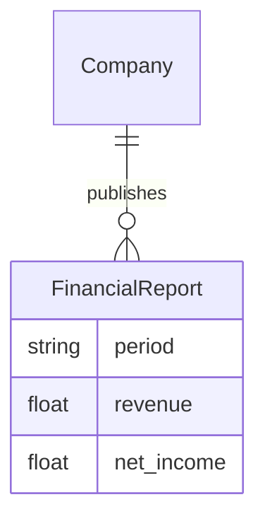

# 领域模型: [项目名]

> ⚠️ 本文件为骨架,请运行 `/init` 或手动填充以下内容。
> 完成后删除此提示行。

## 核心实体

<!-- 用 mermaid erDiagram 画出核心实体和关系 -->
<!-- 示例:

-->

## 业务规则(不可违反)

<!-- 列出 agent 在生成代码时绝对不能违反的规则 -->
<!-- 示例:
- 所有金额单位统一为人民币万元
- 数据以 cninfo 官方披露为权威源
-->

## 术语表

| 中文术语 | 英文术语 | 定义 | 代码中的命名 |
|--------|--------|------|-----------|
| <!-- 填充 --> | | | |

## 数据边界

- 数据源: <!-- 列出所有数据源及其可信度 -->
- 更新频率: <!-- 各数据源的更新周期 -->
- 已知数据质量问题: <!-- 如 AkShare 参数漂移 -->
